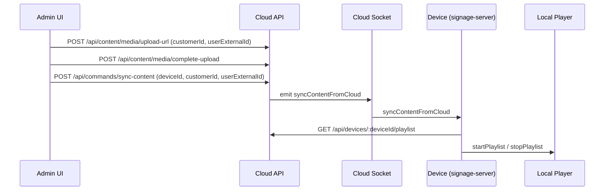
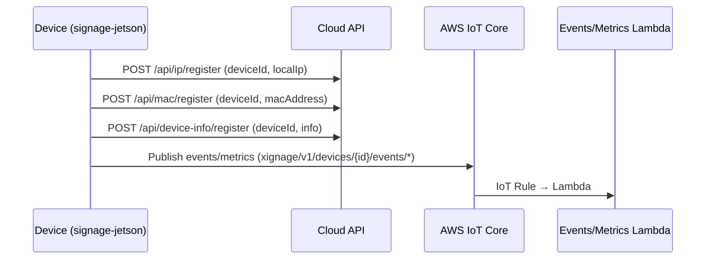
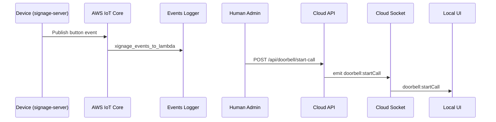

# 横断APIリファレンス

目的: 各パッケージの API / Socket / IoT / 権限 / フローを 1 枚で俯瞰するための横断リファレンス。
実装コードは参照のみで、断定できない点は TODO を明記します。

## 1) Actors と責務の概要

- Cloud API (signage-aws-nodejs): 管理 UI / アプリからの HTTP 入口、Socket.IO でデバイス制御
- Device (signage-server + signage-jetson): デバイスローカル API / Socket、クラウド Socket 受信、IoT Pub
- Admin UI (signage-admin-ui): Cloud API への操作クライアント
- Infra (xignage-infra-aws): AWS IoT ルール、イベント/メトリクス処理基盤
- Human Admin(通常): userExternalId を持つ利用者 (顧客スコープ)
- System(master): MASTER_USER_EXTERNAL_IDS で許可された管理者

## 2) 認証/権限モデル (Human / Device / master/system)

| Actor | 認証情報/ID | 主な判定/権限条件 | 備考 | 根拠 |
| --- | --- | --- | --- | --- |
| Human Admin(通常) | userExternalId | requireHumanUser + customer/device アクセスチェック | userExternalId はクエリ/ボディから取得 | signage-aws-nodejs/middlewares/humanAuth.js |
| System(master) | userExternalId | isMasterUser が true ならアクセスチェックをスキップ | MASTER_USER_EXTERNAL_IDS に依存 | signage-aws-nodejs/services/userDevicesService.js |
| Internal (system) | x-internal-token | INTERNAL_API_TOKEN と一致 | 一部 API で内部トークン必須 | signage-aws-nodejs/middlewares/internalAuth.js |
| Device | deviceId | Socket.IO の registerDevice で紐付け | Socket 接続自体の認証はコード上見当たらず | signage-aws-nodejs/socket/deviceRegistry.js |
| Device (IoT) | IOT_* 環境変数 + IoT Thing cert | MQTT クライアント ID は Thing 名 | iot.env / iot-certs を利用 | signage-jetson/scripts/io/aws_iot_pub.py |

TODO: userExternalId の真正性を担保するトークン/署名検証は repo 内で確認できず。

根拠: signage-aws-nodejs/middlewares/humanAuth.js、signage-admin-ui/src/context/UserContext.tsx

## 3) API サーフェス別の索引テーブル

### Cloud HTTP endpoints (主要 route groups)

| ルート群 | 代表パス | 主な用途 | 主要パラメータ(必須) | 権限 | 根拠 |
| --- | --- | --- | --- | --- | --- |
| Device registration | `/api/ip/register` `/api/mac/register` `/api/device-info/register` | 端末 IP/MAC/情報の登録 | deviceId, localIp/macAddress/info | Device (未認証) | signage-aws-nodejs/routes/device/*.js |
| Device sync | `/api/devices/:deviceId/sync-complete` | 同期完了の記録 | deviceId, (playlistId または既存紐付け) | Device (未認証) | signage-aws-nodejs/routes/device/deviceSyncRoutes.js |
| Player playlist | `/api/devices/:deviceId/playlist` | 再生プレイリスト取得 | deviceId, (customerId/playlistId は任意) | Device (未認証) | signage-aws-nodejs/routes/player/devicePlaylistRoutes.js |
| Player manifest | `/api/devices/:deviceId/media-manifest` | 取得対象メディア一覧 | deviceId, (customerId/playlistId は任意) | Device (未認証) | signage-aws-nodejs/routes/player/devicePlaylistRoutes.js |
| Admin content | `/api/content/media` `/api/content/playlists` | メディア/プレイリスト管理 | customerId, userExternalId | Human + customer access | signage-aws-nodejs/routes/admin/contentRoutes.js |
| Admin device playlist | `/api/devices/:deviceId/playlist-assignment` `/api/devices/:deviceId/sync-status` | 割当/同期状態確認 | deviceId, customerId, userExternalId | Human + customer access | signage-aws-nodejs/routes/admin/devicePlaylistRoutes.js |
| Admin user devices | `/api/user/devices` | ユーザーに紐付くデバイス取得 | userExternalId | Human | signage-aws-nodejs/routes/admin/userDevicesRoutes.js |
| Admin commands | `/api/commands/*` | 再生/更新/回転/同期/音量 | deviceId, userExternalId | Human + device access | signage-aws-nodejs/routes/admin/command/*.js |
| Admin status | `/api/status` `/api/version/versions` `/api/patchMigState` | 端末状態/版本/パッチ状態 | deviceId, userExternalId | Human + device access | signage-aws-nodejs/routes/admin/*.js |
| Admin doorbell | `/api/doorbell/start-call` `/api/doorbell/end-call` | 通話開始/終了 | doorbellEventId, userId, deviceId | Human + device access | signage-aws-nodejs/routes/admin/doorbellRoutes.js |
| System master | `/api/admin/*` | 顧客/デバイス管理 | userExternalId | System(master) | signage-aws-nodejs/routes/admin/adminRoutes.js |
| Call UI | `/call/join/mobile/:callId` | 通話 UI (Daily) | callId, deviceId, userExternalId | Human + device access | signage-aws-nodejs/routes/admin/callRoutes.js |

Admin UI から実際に叩く API 例:

| 機能 | エンドポイント | 必須パラメータ | 根拠 |
| --- | --- | --- | --- |
| デバイス一覧 | `/api/user/devices` | userExternalId | signage-admin-ui/src/context/UserContext.tsx |
| 同期ステータス | `/api/devices/:deviceId/sync-status` | customerId, userExternalId | signage-admin-ui/src/page/Layout.tsx |
| 同期開始 | `/api/commands/sync-content` | deviceId, customerId, userExternalId | signage-admin-ui/src/page/Layout.tsx |
| メディア一覧 | `/api/content/media` | customerId, userExternalId | signage-admin-ui/src/page/MediaList.tsx |
| メディアアップロード | `/api/content/media/upload-url` `/api/content/media/complete-upload` | customerId, userExternalId | signage-admin-ui/src/hook/useUpload.ts |
| プレイリスト操作 | `/api/content/playlists` `/api/content/playlists/:id/items` | customerId, userExternalId | signage-admin-ui/src/page/PlaylistsList.tsx |

### Device local HTTP endpoints (存在するもののみ)

| ルート群 | 代表パス | 主な用途 | 備考 | 根拠 |
| --- | --- | --- | --- | --- |
| Kiosk | `/api/kiosk` | kiosk.html 表示 | Device local | signage-server/routes/kioskRoutes.js |
| Views | `/api/views/switch/:view` | ローカル UI 切替 | Socket.IO へ switchView | signage-server/routes/viewRoutes.js |
| AI Assist | `/api/ai-assist` `/api/ai-assist/update` `/api/ai-assist/latest` | AI assist 画面/更新 | Device local | signage-server/routes/aiAssistRoutes.js |
| Config | `/api/config` | ローカル設定取得 | /var/lib/signage_local/localSettings.json | signage-server/routes/configRoutes.js |
| Doorbell (device) | `/api/doorbell/test` `/api/doorbell/start-call` | IoT テスト/通話開始 stub | IoT publish | signage-server/routes/doorbellRoutes.js |
| Local playlist | `/localPlaylist` | ローカル playlist.json | 端末内再生 | signage-server/routes/localPlaylistRoutes.js |
| Health | `/health` `/ping` | ヘルスチェック | Device local | signage-server/app.js |

### Socket events (方向/ACK/payload/権限)

| イベント | 方向 | ACK | payload 要点 | 権限 | 根拠 |
| --- | --- | --- | --- | --- | --- |
| registerDevice | Device → Cloud | なし | deviceId | Device (未認証) | signage-aws-nodejs/socket/deviceRegistry.js |
| startPlaylist / stopPlaylist | Cloud → Device | なし | 任意 payload | Human + device access | signage-aws-nodejs/services/command/emitCommand.js |
| toggleRotation / forceKiosk / startUpdate / networkResetCommand | Cloud → Device | なし | deviceId | Human + device access | signage-aws-nodejs/routes/admin/command/systemRoutes.js |
| setVolume / toggleVolume | Cloud → Device | なし | volume, requestId | Human + device access | signage-aws-nodejs/routes/admin/command/volumeRoutes.js |
| playVideo / showImage / switchView | Cloud → Device | なし | fileName など | Human + device access | signage-aws-nodejs/routes/admin/command/playRoutes.js |
| syncContentFromCloud | Cloud → Device | なし | deviceId | Human + customer access | signage-aws-nodejs/routes/admin/command/systemRoutes.js |
| getVersions / versionsResponse | Cloud ↔ Device | あり | requestId / version info | Human + device access | signage-aws-nodejs/routes/admin/versionRoutes.js |
| getPatchMigState / patchMigStateResponse | Cloud ↔ Device | あり | requestId / state | Human + device access | signage-aws-nodejs/routes/admin/patchMigRoutes.js |
| requestDeviceInfo / deviceInfoResponse | Cloud ↔ Device | あり | requestId / info | Human + device access | signage-aws-nodejs/routes/admin/deviceInfoRoutes.js |
| doorbell:startCall | Cloud → Device | なし | callId, joinUrlDevice, deviceId | Human + device access | signage-aws-nodejs/routes/admin/doorbellRoutes.js |
| volumeStatusChanged | Device → Cloud | なし | requestId, muted | Device | signage-server/public/js/main.js |
| net:report | Cloud → Device | あり | ACK で snap | Human + device access | signage-aws-nodejs/routes/admin/command/networkRoutes.js |

TODO: Socket.IO 接続時の認証/署名方式はコード上確認できず。

根拠: signage-aws-nodejs/socket/index.js、signage-server/sockets/cloudSocket/index.js

### IoT / MQTT topics

| Topic | Pub/Sub | 用途 | 前提 | 根拠 |
| --- | --- | --- | --- | --- |
| `xignage/v1/devices/{DEVICE_ID}/events/{button\|presence}` | Device pub → IoT rule sub | ボタン/ToF イベント通知 | IOT_ENDPOINT, IOT_THING_NAME, 証明書 | signage-jetson/scripts/io/aws_iot_pub.py |
| `xignage/v1/devices/{DEVICE_ID}/events/button` | Device pub → IoT rule sub | ドアベルテスト通知 | AWS_IOT_ENDPOINT | signage-server/services/iotDoorbellPublisher.js |
| `xignage/v1/devices/{DEVICE_ID}/metrics/system` | Device pub → IoT rule sub | メトリクス送信 | IOT_* env / mqtts | signage-jetson/scripts/metrics/index.js |
| `SELECT * FROM 'xignage/v1/devices/+/events/#'` | IoT rule | events → Lambda | IoT ルール | xignage-infra-aws/README.md |
| `SELECT topic(4) AS deviceId, * FROM 'xignage/v1/devices/+/metrics/+'` | IoT rule | metrics → Lambda | IoT ルール | xignage-infra-aws/lib/metrics/metrics-rule.ts |

## 権限マトリクス

| 対象 | Admin(通常) | System(master) | Device | 未認証 | 根拠 |
| --- | --- | --- | --- | --- | --- |
| Cloud HTTP: `/api/content/*` | 許可 (userExternalId + customerId) | 許可 (master bypass) | 禁止 | 禁止 (userExternalId 必須) | signage-aws-nodejs/routes/admin/contentRoutes.js |
| Cloud HTTP: `/api/commands/*` | 許可 (device access) | 許可 (master bypass) | 禁止 | 禁止 | signage-aws-nodejs/routes/admin/command/*.js |
| Cloud HTTP: `/api/admin/*` | 禁止 | 許可 (requireMasterUser) | 禁止 | 禁止 | signage-aws-nodejs/routes/admin/adminRoutes.js |
| Cloud HTTP: `/api/user/devices` | 許可 (userExternalId) | 許可 | 禁止 | 禁止 | signage-aws-nodejs/routes/admin/userDevicesRoutes.js |
| Cloud HTTP: `/api/devices/:deviceId/playlist` | 禁止 | 禁止 | 許可 (用途は Device) | 許可 (認証なし) | signage-aws-nodejs/routes/player/devicePlaylistRoutes.js |
| Cloud HTTP: `/api/ip/register` `/api/mac/register` `/api/device-info/register` | 禁止 | 禁止 | 許可 (用途は Device) | 許可 (認証なし) | signage-aws-nodejs/routes/device/*.js |
| Socket: device control (start/stop, rotate, update, view) | 許可 (HTTP 経由) | 許可 (master bypass) | 受信のみ | 禁止 | signage-aws-nodejs/routes/admin/command/*.js |
| Socket: versions/patch state | 許可 (HTTP 経由) | 許可 | 返信のみ | 禁止 | signage-aws-nodejs/routes/admin/versionRoutes.js |
| IoT: events/metrics publish | 禁止 | 禁止 | 許可 (IoT cert) | 禁止 | xignage-infra-aws/lib/iot-device-policy.ts |

## 4) 代表フロー (Mermaid)

### メディア/プレイリスト/同期

根拠: signage-admin-ui/src/hook/useUpload.ts、signage-aws-nodejs/routes/admin/command/systemRoutes.js、signage-server/sockets/cloudSocket/playlistCommands.js

### デバイス登録/プロビジョニング/監視

根拠: signage-aws-nodejs/routes/device/*.js、signage-jetson/scripts/io/aws_iot_pub.py、xignage-infra-aws/README.md

### 呼び出し/通話 (Doorbell)

根拠: signage-server/services/iotDoorbellPublisher.js、xignage-infra-aws/README.md、signage-aws-nodejs/routes/admin/doorbellRoutes.js、signage-server/public/js/main.js

## 5) 既存詳細ページ（packages/*）へのリンク集

- signage-aws-nodejs ルーティング: `../packages/signage-aws-nodejs/routes.md`
- signage-aws-nodejs ソケット: `../packages/signage-aws-nodejs/socket.md`
- signage-admin-ui API contract: `../packages/signage-admin-ui/api.md`
- signage-server API ルーティング: `../packages/signage-server/api/routes.md`
- signage-server ローカルソケット: `../packages/signage-server/components/local-socket.md`
- signage-server クラウドソケット: `../packages/signage-server/components/cloud-socket.md`
- signage-jetson IoT 証明書/環境: `../packages/signage-jetson/infra/aws-iot-certs.md`
- xignage-infra-aws IoT: `../packages/xignage-infra-aws/iot.md`
