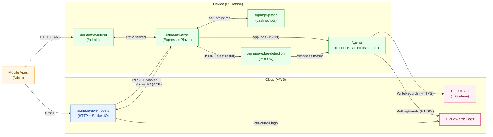
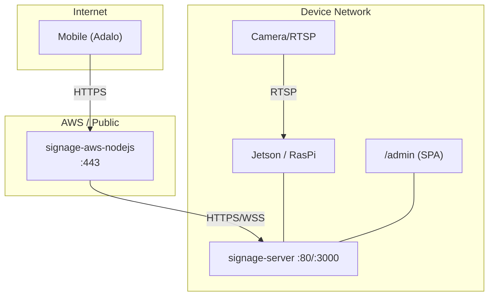
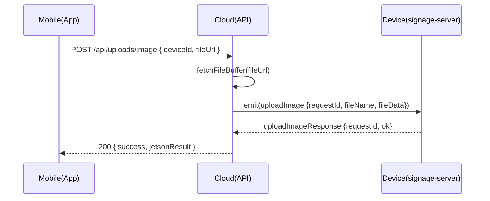
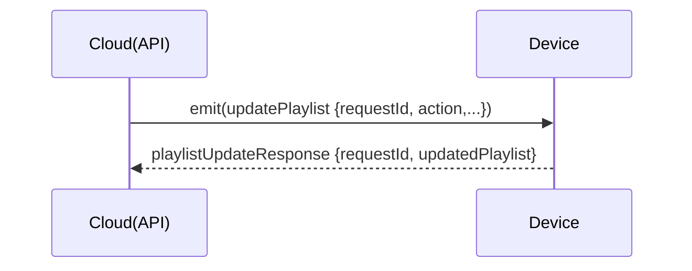
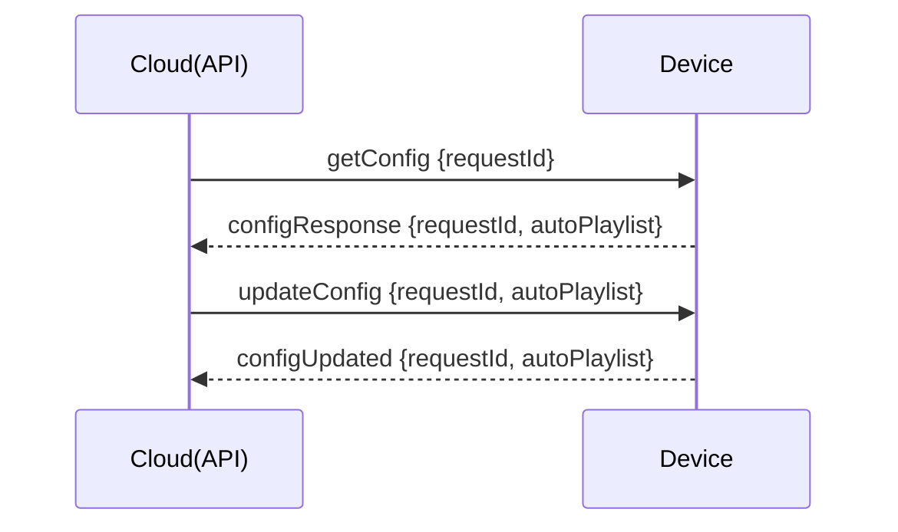
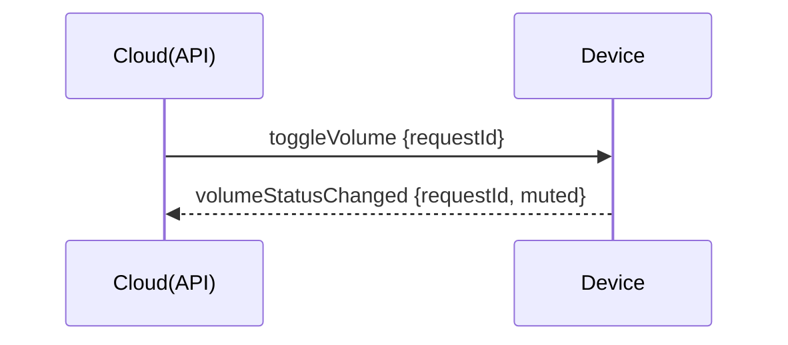

# Architecture（Overview）

本ページは、Xignage の**論理構成／配置／ネットワーク／セキュリティ／主要フロー／運用**を1枚に集約した概要です。

> ## 1. Logical Architecture（論理構成）

### データフロー要約

- **Adalo →（REST）→ signage-aws-nodejs →（WebSocket/Socket.IO）→ signage-server（Device）→ 再生**
- ローカル管理は **signage-admin-ui** へ直接アクセス（/admin）
- 端末の OS/アプリ更新は **Mender（OTA）** による段階配信・ロールバック

### 要点

- **ACK相関**：`requestId` で往復の一致確認（誤解決防止）
- **Upload** はクラウド→デバイスへ **Buffer直送**（サイズ上限で防御）
- **Edge** は最新結果のみを **JSON にアトミック書き込み**

> ## 2. Deployment / Topology（配置）

### 前提

- クラウドは 443/TCP 終端（REST/Socket.IO）
- 端末はアウトバウンド 443/TCP があれば動作（NAT想定）
- Admin UI は端末ローカル配信（/admin）

> ## 3. Network & Ports（一覧）

| スコープ | プロトコル/ポート | 方向 | 用途 | 備考 |
| --- | --- | --- | --- | --- |
| Cloud | HTTPS :443 | Inbound | REST / Socket.IO | ALB/NGINX 等で終端 |
| Device→Cloud | HTTPS :443 | Outbound | 制御・ACK 往復 | NAT想定 |
| Device Local | HTTP :80 / :3000 | Local/LAN | signage-server | どちらか運用ポートに統一可 |
| Camera→Device | RTSP :554 | Local/LAN | Edge入力 | 任意（未使用構成も可） |
| Upload | HTTP/WS | 双方向 | 画像/動画転送 | **サイズ上限/拡張子制限**必須 |
| Admin | HTTP(S) | Local/LAN | /admin | CORS: `origin` 限定 |
| Device→AWS | HTTPS :443 | Outbound | **CloudWatch Logs** へ PutLogEvents（Fluent Bit / aws-for-fluent-bit） | 端末に IAM 資格情報（安全管理が前提） |
| Device→AWS | HTTPS :443 | Outbound | **Timestream** へ WriteRecords（メトリクス） | 時刻同期必須（NTP） |
| Cloud(API)→AWS | AWS SDK | 内部 | （必要に応じて）API 自身の構造化ログを CloudWatch へ | IAM 権限で実行 |

**推奨**：`Socket.IO maxHttpBufferSize` と `body size` を明示設定（大容量防御）

> ## 4. Security & Trust（方針）

- **境界**：Cloud（公開）／Device（店舗LAN）／Mobile（公衆網）
- **入力防御**：CORS（許可Origin限定）／レート制限／MIME/拡張子/サイズ検証
- **Secrets**：Release/Gist 用 PAT は**最小スコープ**・定期ローテ
- **認証**（将来）：`Authorization: Bearer <JWT>` を Cloud API に導入（段階移行）
- **権限分離**：Upload/Control 系のエンドポイントを**明確に分離し**監査ログ出力

> ## 5. Data Flows（主要フロー）

### 5.1 Media Upload（Adalo→AWS→Device）

### 5.2 Playlist Update（ACK）

### 5.3 DeviceSettings get/update（ACK）

### 5.4 Volume Toggle（ACK）

> ## 6. 設計原則（Guiding Principles）

- **現場復旧容易性**：AP フォールバック／A/B ロールバック／再フラッシュ手順の標準化
- **宣言的設定**：環境変数・cloud-init・スクリプト化で再現性を担保
- **オフライン耐性**：接続断でも最低限のローカル機能を維持
- **最小公開・分離**：公開ポート最小化／証明書管理／権限・コンポーネント分離

> ## 7. Ops / SLO & Observability

### 目標例（初期）

- API 成功率 ≥ 99.9%（5xx/タイムアウト除く）
- 重要 ACK レイテンシ p95 ≤ 2.0s（upload除く）
- 端末オンライン率 ≥ 99.5%

### 監視指標

- HTTP：リクエスト数/成功率/レイテンシ（p50/p95）
- Socket：接続数/切断率/ACKタイムアウト数
- Device：CPU/GPU/温度、JSON更新間隔（Edge検知）
- Upload：サイズ分布/失敗率

### 運用

- リリース：vMAJOR.MINOR.PATCH、プレリリース除外
- ロールバック：前タグの Asset を即時差し替え
- 監査：管理系エンドポイントは必ず構造化ログ

### Metrics / Logs（収集・可視化の実装方針）

#### 1) **Metrics（メトリクス）**  

**スタック**：**Amazon Timestream → Grafana**（可視化）
**送信経路**：**Device → Timestream（WriteRecords, HTTPS）** へ **直接送信**（Agent 経由）
**代表メトリクス**：Cloud（API）/ Device の項目は従来どおり
**相関**：`requestId` をディメンションに含めて ACK 往復を追跡

#### 2) **Logs（ログ）**  

- **スタック**：**CloudWatch Logs**
- **送信経路**：
  **Device → CloudWatch Logs**：Agent（Fluent Bit / aws-for-fluent-bit）が **PutLogEvents(HTTPS)** で直接送信
  **Cloud(API)**：アプリの構造化ログをランタイム経由で **CloudWatch Logs** へ（必要に応じて）
- **形式**：構造化 JSON（`ts, level, msg, service, deviceId, requestId, route, status, latency_ms`）

#### 3) **ダッシュボード（初期）**

- Service Health：API 成功率 / p95 レイテンシ / ACK タイムアウト率
- Device Fleet：オンライン台数 / `json_freshness_seconds` ヒートマップ
- Content Flow：アップロード成功率・サイズ分布・playlist 操作数
- Infra：CPU 温度 / Disk 空き / 端末→Cloud ログ送信件数
