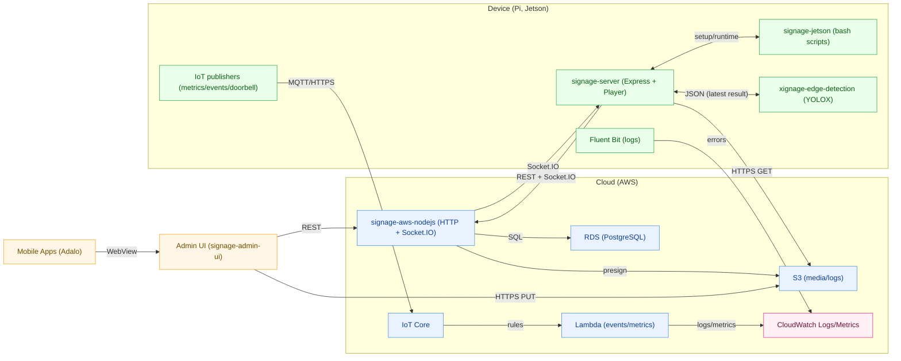
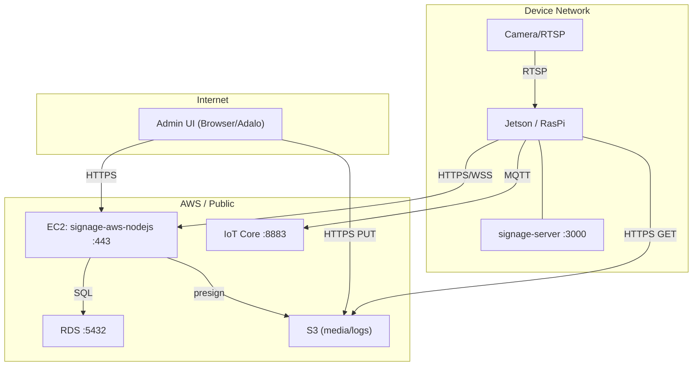
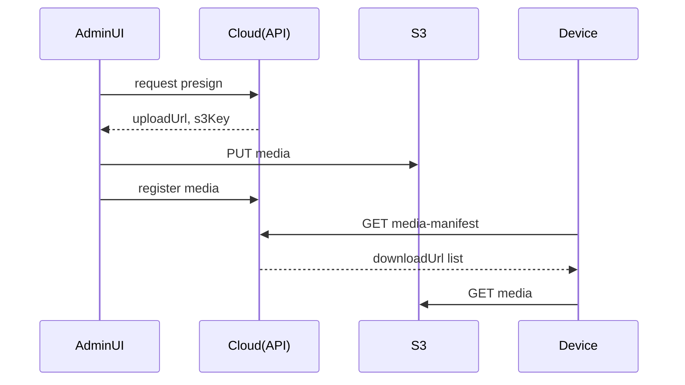
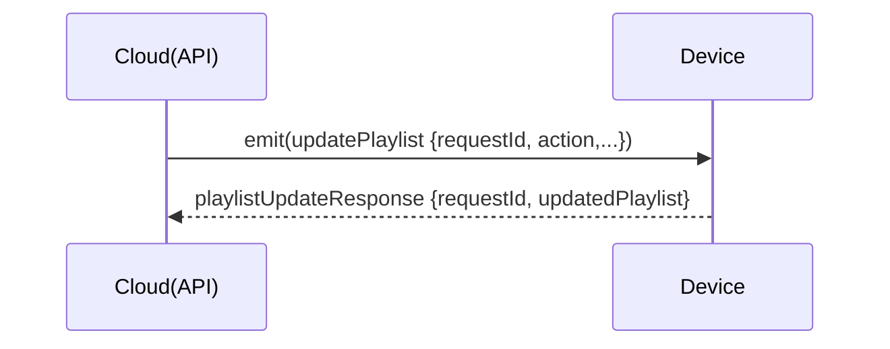
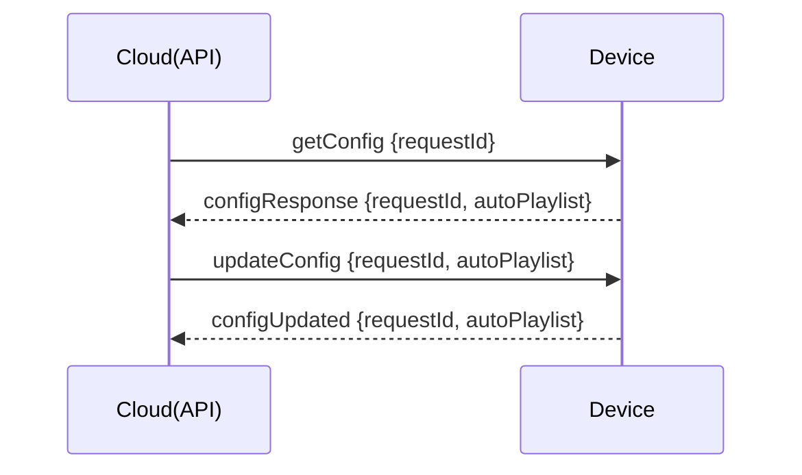
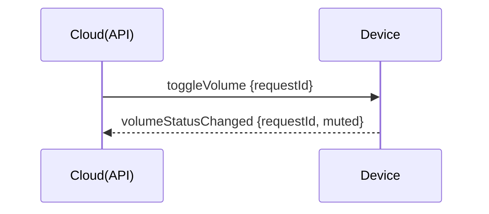

# Architecture（Overview）

本ページは、Xignage の**論理構成／配置／ネットワーク／セキュリティ／主要フロー／運用**を1枚に集約した概要です。

> ## 1. Logical Architecture（論理構成）

### データフロー要約

- **Admin UI（Adalo/Browser）→（REST）→ signage-aws-nodejs →（Socket.IO）→ signage-server（Device）→ 再生**
- **Upload は S3 presigned URL**（Admin UI から直接 PUT、Device は presigned URL で GET）
- **IoT Core** は events/metrics/doorbell の送信に使用（Device → IoT）

### 要点

- **ACK相関**：`requestId` で往復の一致確認（誤解決防止）
- **Upload** は **S3 presigned URL** を利用（メディア本体は S3 で保持）
- **Edge** は最新結果のみを **JSON にアトミック書き込み**

> ## 2. Deployment / Topology（配置）

### 前提

- クラウドは 443/TCP 終端（REST/Socket.IO）
- 端末はアウトバウンド 443/TCP と 8883/TCP があれば動作（NAT想定）
- Admin UI はクラウド側ホスティング（ブラウザ/Adalo から HTTPS アクセス）

> ## 3. Network & Ports（一覧）

| スコープ | プロトコル/ポート | 方向 | 用途 | 備考 |
| --- | --- | --- | --- | --- |
| Cloud | HTTPS :443 | Inbound | REST / Socket.IO | ALB/NGINX 等で終端 |
| Admin UI→Cloud | HTTPS :443 | Outbound | Admin UI → API | ブラウザ/Adalo からアクセス |
| Device→Cloud | HTTPS/WSS :443 | Outbound | 制御・ACK 往復 | NAT想定 |
| Cloud→RDS | TCP :5432 | Internal | PostgreSQL | VPC 内通信 |
| Cloud→S3 | HTTPS :443 | Outbound | presign / SDK | IAM 権限で実行 |
| Admin UI→S3 | HTTPS :443 | Outbound | メディア PUT（presigned URL） | CORS 設定が必要 |
| Device→S3 | HTTPS :443 | Outbound | メディア GET（presigned URL）/ログ送信 | Fluent Bit は S3 送信も使用 |
| Device→IoT Core | MQTT/TLS :8883 | Outbound | events/metrics/doorbell | IoT 証明書が必要 |
| Device Local | HTTP :3000 | Local | signage-server | ローカル再生/UI |
| Camera→Device | RTSP :554 | Local | Edge入力 | 任意（未使用構成も可） |
| Device→CloudWatch Logs | HTTPS :443 | Outbound | Fluent Bit error logs | IAM 資格情報が前提 |

**推奨**：`Socket.IO maxHttpBufferSize` と `body size` を明示設定（大容量防御）

> ## 4. Security & Trust（方針）

- **境界**：Cloud（公開）／Device（店舗LAN）／Mobile（公衆網）
- **入力防御**：CORS（許可Origin限定）／レート制限／MIME/拡張子/サイズ検証
- **Secrets**：Release/Gist 用 PAT は**最小スコープ**・定期ローテ
- **認証**（将来）：`Authorization: Bearer <JWT>` を Cloud API に導入（段階移行）
- **権限分離**：Upload/Control 系のエンドポイントを**明確に分離し**監査ログ出力

> ## 5. Data Flows（主要フロー）

### 5.1 Media Upload（Admin UI→S3→Device）

### 5.2 Playlist Update（ACK）

### 5.3 DeviceSettings get/update（ACK）

### 5.4 Volume Toggle（ACK）

> ## 6. 設計原則（Guiding Principles）

- **現場復旧容易性**：AP フォールバック／A/B ロールバック／再フラッシュ手順の標準化
- **宣言的設定**：環境変数・cloud-init・スクリプト化で再現性を担保
- **オフライン耐性**：接続断でも最低限のローカル機能を維持
- **最小公開・分離**：公開ポート最小化／証明書管理／権限・コンポーネント分離

> ## 7. Ops / SLO & Observability

### 目標例（初期）

- API 成功率 ≥ 99.9%（5xx/タイムアウト除く）
- 重要 ACK レイテンシ p95 ≤ 2.0s（upload除く）
- 端末オンライン率 ≥ 99.5%

### 監視指標

- HTTP：リクエスト数/成功率/レイテンシ（p50/p95）
- Socket：接続数/切断率/ACKタイムアウト数
- Device：CPU/GPU/温度、JSON更新間隔（Edge検知）
- Upload：サイズ分布/失敗率

### 運用

- リリース：vMAJOR.MINOR.PATCH、プレリリース除外
- ロールバック：前タグの Asset を即時差し替え
- 監査：管理系エンドポイントは必ず構造化ログ

### Metrics / Logs（収集・可視化の実装方針）

#### 1) **Metrics（メトリクス）**  

**スタック**：**IoT Core → Lambda → CloudWatch PutMetricData**
**送信経路**：**Device → IoT Core（MQTT/TLS）→ ルール → Lambda → CloudWatch**
**代表メトリクス**：Device CPU/温度/オンライン、ACK 往復など
**相関**：`requestId` をディメンションに含めて ACK 往復を追跡

#### 2) **Logs（ログ）**  

- **スタック**：**S3（フルログ） + CloudWatch Logs（error）**
- **送信経路**：
  **Device → S3**：Fluent Bit が journald/metrics を S3 へ送信
  **Device → CloudWatch Logs**：Fluent Bit が error レベルのみ送信
  **Cloud(API)/Lambda**：ランタイム経由で CloudWatch Logs へ
- **形式**：構造化 JSON（`ts, level, msg, service, deviceId, requestId, route, status, latency_ms`）

#### 3) **ダッシュボード（初期）**

- Service Health：API 成功率 / p95 レイテンシ / ACK タイムアウト率
- Device Fleet：オンライン台数 / `json_freshness_seconds` ヒートマップ
- Content Flow：アップロード成功率・サイズ分布・playlist 操作数
- Infra：CPU 温度 / Disk 空き / 端末→Cloud ログ送信件数
