*最終更新: 2025-05-25

## 1. レイヤー構成

<!-- markdownlint-disable MD013 -->
| レイヤー | コンポーネント | 主な役割 | 使用技術 |
|----------|---------------|----------|----------|
| Edge デバイス | signage-jetson | OS セットアップ／OTA／ネットワーク管理スクリプト | Bash・systemd |
|            | signage-server | 常駐 Node.js サーバ（WebSocket クライアント、メディア制御 API） | Node.js 22, Socket.IO |
|            | signage-admin-ui | ローカル管理 UI | React 19, React Router 7 |
| クラウド    | signage-aws-nodejs | REST API & WebSocket ブリッジ | Node.js 22, AWS API Gateway/Lambda（構成図リンク） |
| ユーザーアプリ | Adalo アプリ | iOS/Android UI（REST 利用） | Adalo |

## 2. コンポーネント詳細

### 2.1 signage-jetson

- **配置**: Edge デバイス `/opt/signage-core/signage-jetson`
- **責務**:  
  1. SD/SSD 初期セットアップ  
  2. OTA 更新スクリプト  
  3. Wi-Fi/AP 自動切替  
- **依存**: systemd, bash ≥ 5.1

### 2.2 signage-server

- **配置**: Edge デバイス `/opt/signage-core/signage-server`
- **責務**  
  1. WebSocket 常時接続 → signage-aws-nodejs  
  2. メディア再生制御 (`chromium --app=…`)  
  3. ローカル REST `/api/`（admin-ui 用）
- **依存**: Node.js 22, Socket.IO v4, ffmpeg

### 2.3 signage-admin-ui

…（同様に「配置」「責務」「依存」）

### 2.4 signage-aws-nodejs

…（同様に記載。API パス一覧、S3 バケット構造なども後段で追加予定）

## 3. インタラクション図

```mermaid
sequenceDiagram
    participant App as "Adalo App"
    participant AWS as "signage-aws-nodejs"
    participant Dev as "signage-server"
    App->>+AWS: REST /command POST
    AWS-->>App: 200 OK
    AWS-->>Dev: socket.io emit("command", payload)
    Dev-->>Chromium: local IPC /api/play?file=… (HTTP)
```

