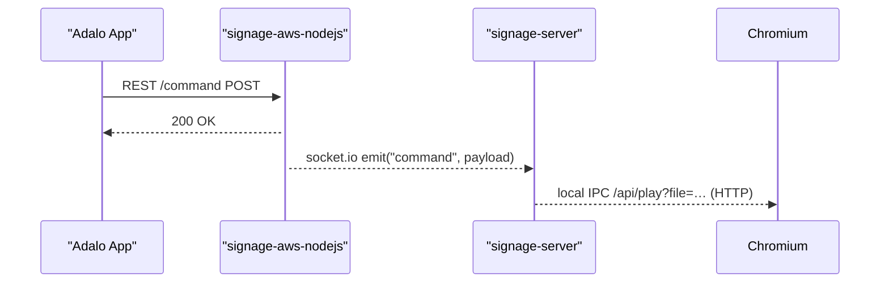

# ソフトウェアスタック

*最終更新: 2025-05-25

## 1. レイヤー構成

<!-- markdownlint-disable MD013 -->
|レイヤー|コンポーネント|主な役割|使用技術|
|---|---|---|---|
|Edge デバイス|signage-jetson|OS セットアップ／OTA／ネットワーク管理スクリプト|Bash・systemd|
||signage-server|常駐 Node.js サーバ（WebSocket クライアント、メディア制御 API）|Node.js 22, Socket.IO|
||signage-admin-ui|ローカル管理 UI|React 19, React Router 7|
|クラウド|signage-aws-nodejs|REST API & WebSocket ブリッジ|Node.js 22, AWS API Gateway/Lambda（構成図リンク）|
|ユーザーアプリ|Adalo アプリ|iOS/Android UI（REST 利用）|Adalo|

## 2. コンポーネント詳細

### 2.1 signage-jetson

- **配置**: Edge デバイス `/opt/signage-core/signage-jetson`
- **責務**:  
  1. SD/SSD 初期セットアップ  
  2. OTA 更新スクリプト  
  3. Wi-Fi/AP 自動切替  
- **依存**: systemd, bash ≥ 5.1

### 2.2 signage-server

- **配置**: Edge デバイス `/opt/signage-core/signage-server`
- **責務**  
  1. WebSocket 常時接続 → signage-aws-nodejs  
  2. メディア再生制御 (`chromium --app=…`)  
  3. ローカル REST `/api/`（admin-ui 用）
- **依存**: Node.js 22, Socket.IO v4, ffmpeg

### 2.3 signage-admin-ui

…（同様に「配置」「責務」「依存」）

### 2.4 signage-aws-nodejs

…（同様に記載。API パス一覧、S3 バケット構造なども後段で追加予定）

## 3. インタラクション図

