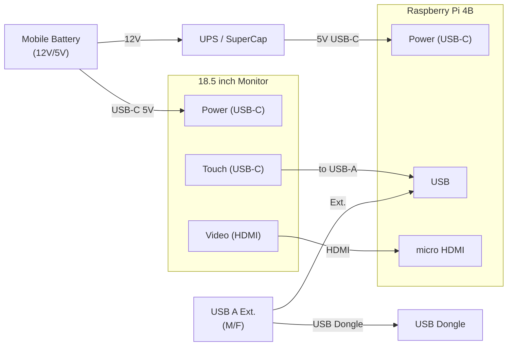
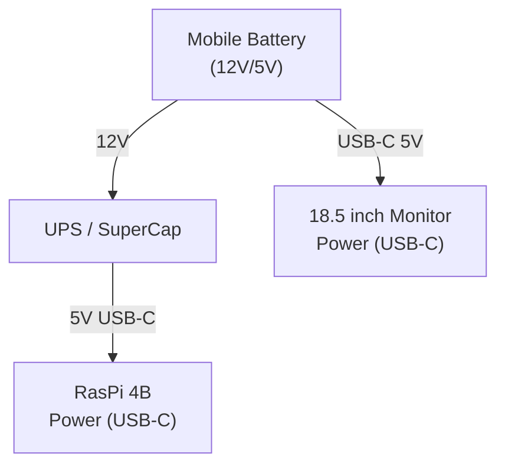
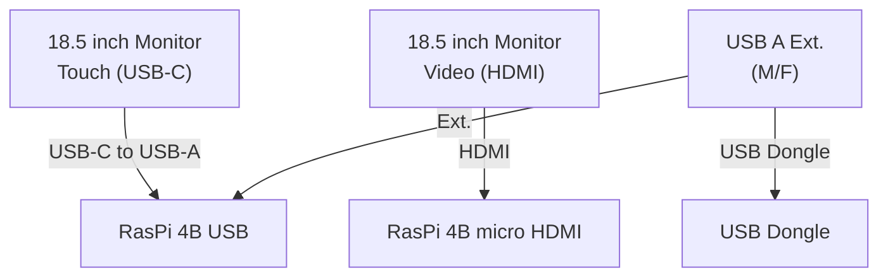

# Wiring（Rev A）

## **Raspberry Pi 4B 配線（ドラフト v1）**

### **接続（ケーブル／電源系）**

- **18.5" モニタ → 電源**：USB Type-C（モバイルバッテリー）
- **18.5" モニタ → タッチ信号**：USB Type-C ↔ USB-A（RasPi USB）
- **18.5" モニタ → 映像**：HDMI ↔（RasPi **micro** HDMI）
- **RasPi → 電源**：USB-C（5V） ← **UPS → USBトリガーケーブル（DCジャック/USB-A 12V）** ← モバイルバッテリー
- **RasPi → 周辺機器**：USB-A オス／メス 延長ケーブル ↔ **USBドングル**

> メモ：micro HDMI 端子使用。UPS → RasPi への 5V 給電経路は「バッテリー →（12V）→ 5V化（UPS）→ RasPi USB-C」。

### **概略図（RasPi 4B 構成）**

1) **電源系（Power）**

2) **信号系（Signals）**

## **GPIO 配線（RasPi 4B）**

> ※ ピン番号は **物理ピン**（左から奇数列）。GND は複数系統で共用。

| 用途           | 色  | 物理ピン | 信号名       |
|----------------|-----|---------:|--------------|
| 電源ボタン     | 黄  | 5        | GPIO3        |
|                | 黒  | 9        | GND          |
|                | 赤  | 18       | GPIO24       |
|                | 白  | 14       | GND          |
| SuperCap (UPS) | 黄  | 16       | GPIO23       |
|                | 白  | 39       | GND          |
| CPUファン      | 赤  | 2        | 5V           |
|                | 黒  | 20       | GND          |
|                | 青  | 8        | TXD (GPIO14) |
| 排気ファン     | 赤  | 4        | 5V           |
|                | 黒  | 6        | GND          |

> 参考：GPIO3（ピン5）は I²C-SCL 兼用。起動時の挙動に影響しないよう **プルアップ/ボタン配線**は後で検証。

## **メモ（後で精緻化）**

- UPS の **5V最大出力**／瞬断保持時間／安全停止連携（GPIO23）を要件化  
- モニタの **タッチパネル識別**（ベンダID/デバイス名）とドライバ要否の確認  
- ドングル（型番）と延長ケーブルの **信号品質**（長さ・シールド）チェック
