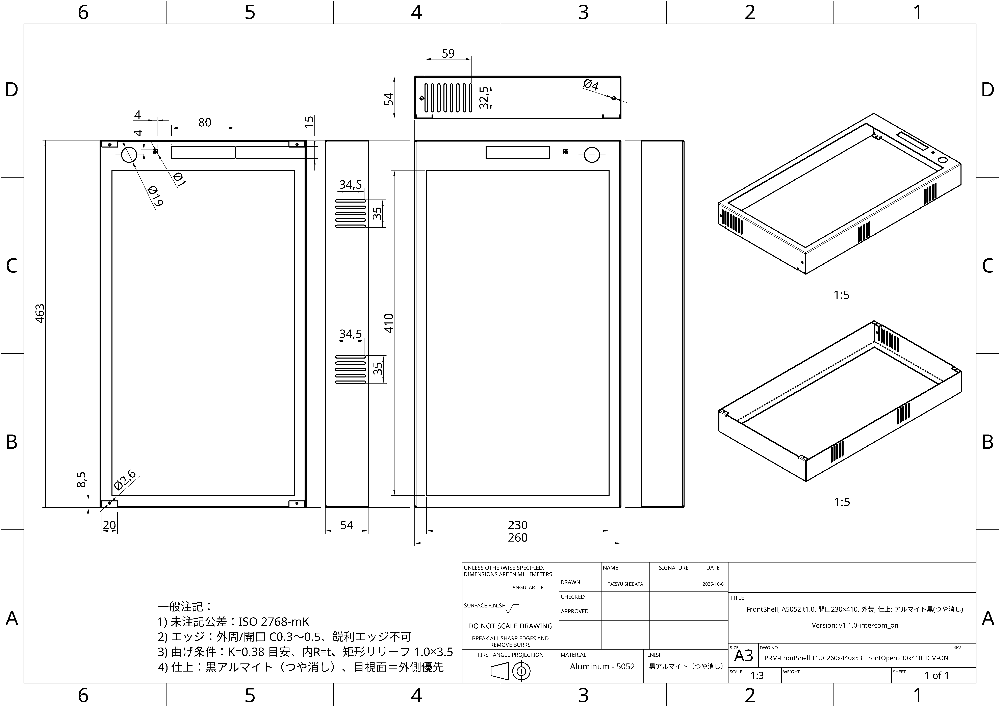
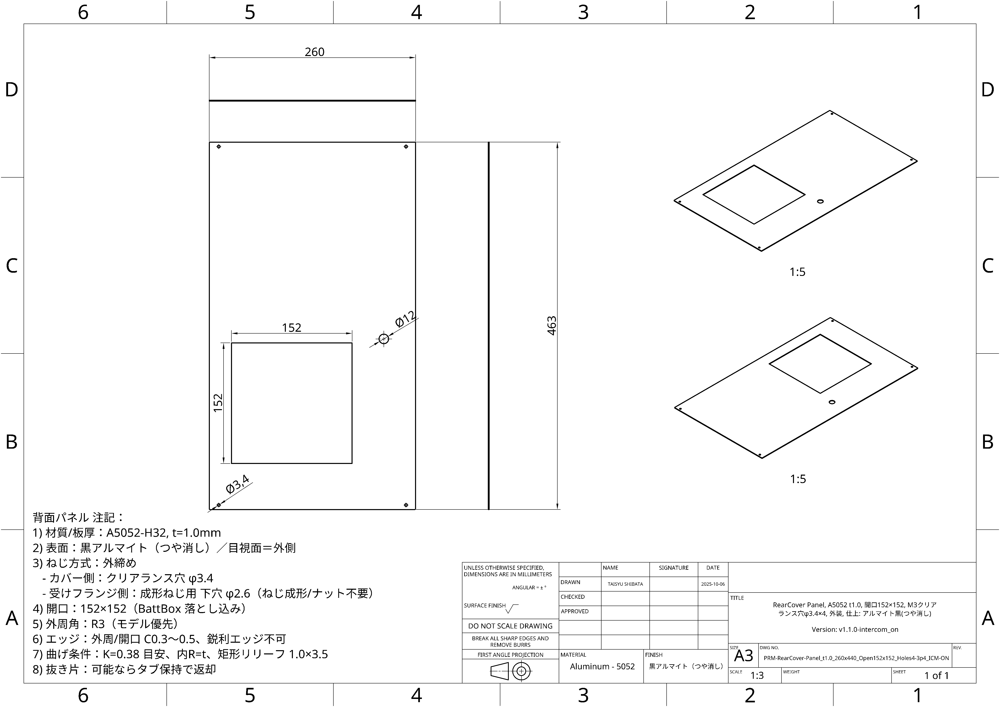
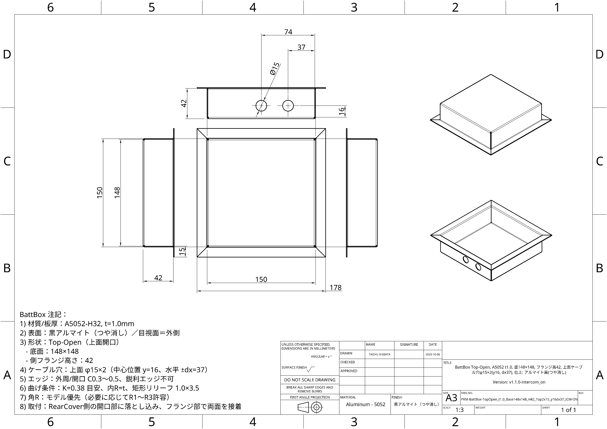
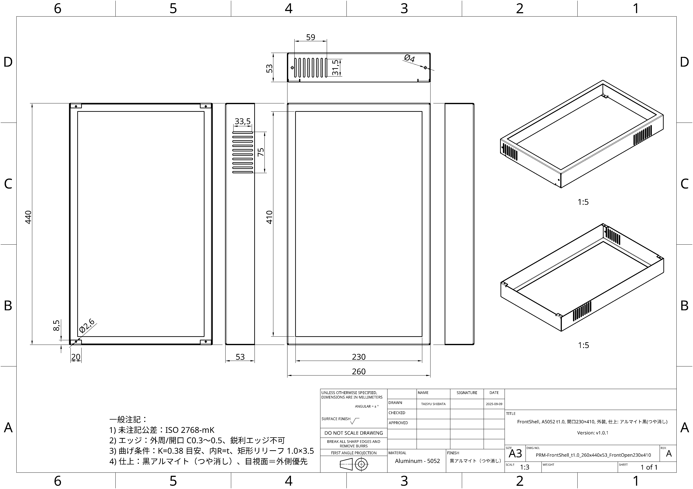
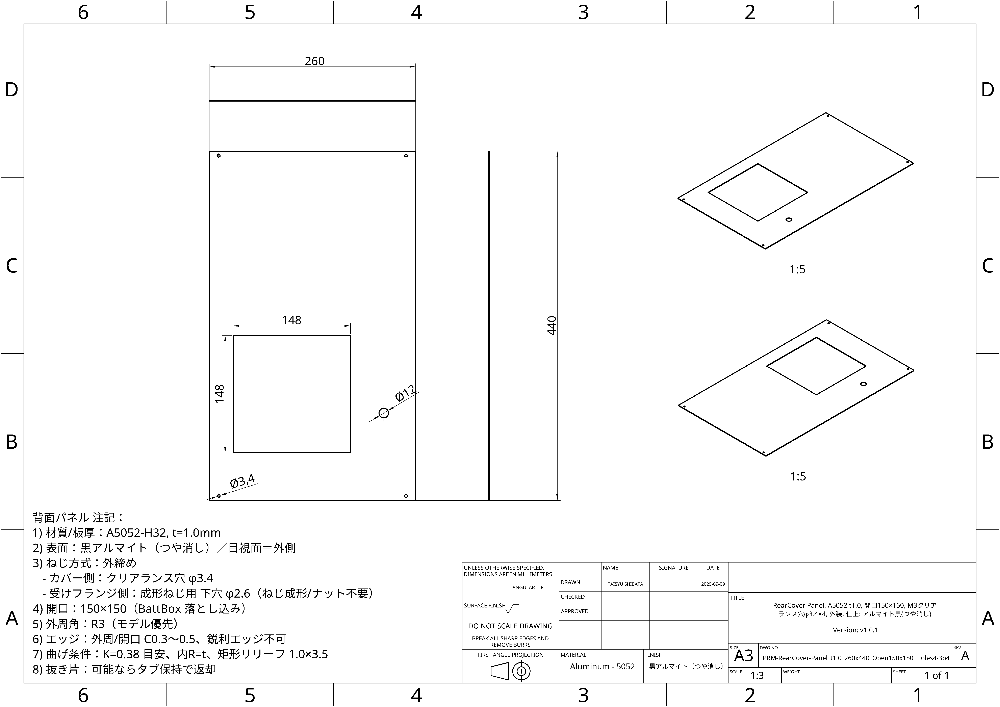
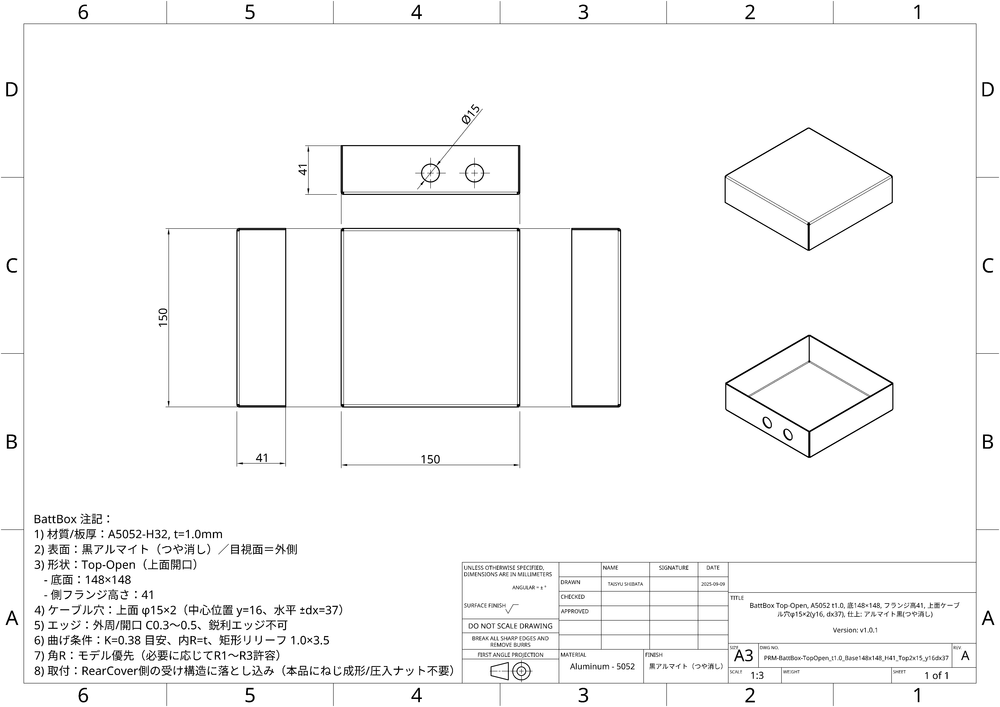

# Frame Overview

> 本フレームは **Intercomあり / なし** の2構成があります。  

## **Intercomあり - Rev v1.1.0**

- **Body (Front Shell, t1.0 / Intercom)**
  
  

- **Rear Cover (Panel, t1.0 / Intercom)**
  
  

- **Battery Box (Top Open, t1.0 / Intercom)**
  
  

### **外形・重量（Intercomあり）**

- 寸法（W × D × H）: **463 × 260 × 54 mm**
- 重量: **2.7 kg**（バッテリー含まず）

---

## **Intercomなし - Rev v1.0.1**

- **Body (Front Shell, t1.0)**
  
  

- **Rear Cover (Panel, t1.0)**
  
  

- **Battery Box (Top Open, t1.0)**
  
  

### **外形・重量（Intercomなし）**

- 寸法（W × D × H）: **440 × 260 × 53 mm**
- 重量: **2.4 kg**（バッテリー含まず）

## **取付・座標系**

- 原点: 前面開口部中央  
- 軸: +X=右 / +Y=上 / +Z=前  
- 取り付け穴・ねじ規格: _後で追記_

## **TODO**

- 図面PDFの寸法番号と本文の寸法リストを対応付け
- 逃がし寸法・最小曲げR・ケーブル取り回しの注意を追記
- 組立手順（関連: `mechanical/assembly.md`）へのリンク追加
