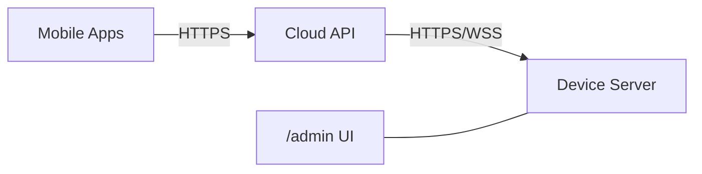

# Xignage Project — Home

**Xignage** は、Jetson/Raspberry Pi をサイネージ端末化し、クラウドから安全に制御・配信するための**フルスタック**です。  
このページは **システム側の総合入口**として、全体像／主要リポジトリ／CI／モバイルアプリへの導線をまとめます。

> ## **全体像（System Overview）**

データフロー要約と設計原則の詳細は → **[Architecture / Overview](architecture/index.md)** を参照。

!!! note
    事業面のビジョン／ユースケースは後日追記予定です。まずは**システム運用**に必要な情報から整備します。

> ## **何から始める？（Quick Start）**

1. **端末セットアップ** → [signage-jetson](packages/signage-jetson/index.md)  
   Openbox+Chromium キオスク、ネットワーク/APフォールバック、更新基盤の導入。
2. **端末バックエンド** → [signage-server](packages/signage-server/index.md)  
   再生・プレイリスト・管理UI(/admin) を端末上で提供。
3. **クラウド制御** → [signage-aws-nodejs](packages/signage-aws-nodejs/index.md)  
   アップロード/一覧/設定/電源/バージョン等を HTTP/Socket.IO で制御。
4. **エッジ検知（任意）** → [xignage-edge-detection](packages/xignage-edge-detection/index.md)  
   YOLOX による人物検知。最新結果を JSON に**アトミック書き込み**。
5. **モバイル運用** → [Mobile Apps（Adalo）](apps/xignage-adalo/index.md)  
   スマホからのアップロード／操作。まずは招待制の Android / iOS で試験運用。
6. **ハード要件の確認** → [Hardware / System Composition](hardware/system_composition.md)

> ## **パッケージと役割（Overview）**

- **signage-jetson**：端末の**初期化・運用基盤**（冪等スクリプト／分割フェーズ）  
  → [docs](packages/signage-jetson/index.md)
- **signage-server**：端末ローカルの**再生サーバ**（Express + /admin UI）  
  → [docs](packages/signage-server/index.md)
- **signage-aws-nodejs**：**クラウド側バックエンド**（REST + Socket.IO + Upload）  
  → [docs](packages/signage-aws-nodejs/index.md)
- **signage-admin-ui**：端末ローカルの**管理 UI**（/admin ベース）  
  → [docs](packages/signage-admin-ui/index.md)
- **xignage-edge-detection**：**人物検知パイプライン**（YOLOX、将来 OpenFace 連携）  
  → [docs](packages/xignage-edge-detection/index.md)

> ## **ハードウェア（Hardware）**

システムを支える **筐体・電気設計・製造** の情報を集約します。  
Rev 管理・BOM・CAD への導線をまとめ、ソフト要件（電源・熱・固定）との整合を確認できます。

- **Overview**：章の入口（構成・導線）  
  → [hardware / Overview](hardware/index.md)
- **System Composition**：採用ボード（Jetson/RasPi）、電源要件、I/O占有、センサ配置、外形寸法の要点  
  → [hardware / System Composition](hardware/system_composition.md)

以降、Electrical（電源/配線/BOM）、Mechanical（フレーム/CAD/組立）、Manufacturing（DFM/DFA/公差/ねじ）、Revisions（Rev A/B）を順次拡張予定。

> ## **Release Snapshot（対応バージョン）**

| リポジトリ | 最新リリース |
|---|---|
| signage-jetson |  |
| signage-server |  |
| signage-aws-nodejs |  |
| signage-admin-ui |  |
| xignage-edge-detection |  |

より詳細な一覧は → [パッケージ一覧](packages/index.md)

> ## **CI / Automation（ハブ）**

各リポの CI は **fmt/lint/test** を基本に、**ライセンス検査／Release 配布／バッジ更新**を自動化。  
運用ポリシー・ワークフローのカタログは → [CI / Automation 概要](ci/index.md)

!!! tip
    Release バッジは **Gist の `release.json`** を更新して Shields.io で表示します（PAT は **gist 限定スコープ**）。

> ## **運用チェックリスト（初期）**

- 端末接続：`/api/status?deviceId=...` が **接続中** を返す  
- メディア：`/api/uploads/image|video` → 一覧/サムネ API が整合  
- プレイリスト：`/api/playlist`（add/move/remove/thumbnail）が往復（ACK）で成功  
- 設定：`/api/deviceSettings/:deviceId` の **get/update**  
- バージョン/パッチ：`/api/version/versions` / `api/patchMigState` が 5s タイムアウト内に応答  
- 管理 UI：`/admin` が端末で表示・操作可能

> ## **変更履歴 / リリース**

- 各リポの Release は `vMAJOR.MINOR.PATCH`（プレリリースは既定で除外）  
- 配布物：端末スクリプト（tar.gz）, サーバ（tar.gz）, ほか  
- バッジ反映：Release 公開時に **Update Release Badge** が自動更新

> ## **プレースホルダ（後日差し替え）**

- **Vision / Business**：プロダクトの狙い・導入価値・KPI（*準備中*）
- **Operations**：監視・アラート・SLO / SLA（*準備中*）

> ## **ナビゲーション**

- **Packages** → [一覧](packages/index.md)
- **CI / Automation** → [ハブ](ci/index.md)
- **Mobile Apps** → [Xignage（Adalo）](apps/xignage-adalo/index.md)
